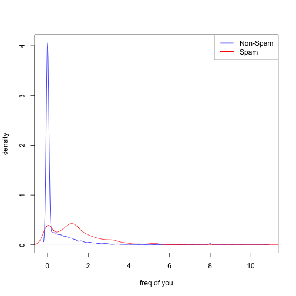

Machine learning comes in two flavours: supervised and unsupervised. The ingredients list for supervised learning is

* an _outcome measurement_, usually quantitative (such as a stock price) or
categorical (such as heart attack/no heart attack)
* a set of _features_ (such as diet and clinical measurements)
* a _training set_ of data, in which we observe the outcome and feature measurements for a set of objects 
* a _prediction model_, or learner, which will enable us to predict the outcome
for new unseen objects

In unsupervised learning, the outcome measurement are *not* available; these problems instead seek _structure_ in the data. 

The components of a predictor are 

1. a very specific and well-defined *question* (what are you trying to predict, and what are you trying to predict it with?)
2. *input data* 
3. measured characteristics or computationally built *features*
4. the *machine learning algorithm*
5. the *estimated parameters* of that algorithm
6. the *application* of those parameters to a new data set, and the *evaluation* of the algorithm on those new data

(Quickly Define Failure And Eject Aircraft)

#### eg: spam detection

1. question: Can quantitiative chararacteristics of emails be use to classify them into spam and ham emails?
2. input data: there is a lot of data avaialble for use, but it may not always be the best; we need to be aware of the limitations of our data. 


```r
require(kernlab)
data(spam)
```

3. features: we need to compute characteristics of emails that we receive to use to classify the set of emails 

Consider the email

_Dear Jeff,  
Can you send me your address so I can send you the invitation?  
Thanks,  
Ben_

One characteristic that may allow us to classify this email as spam or ham is the frequency with which certain words appear. Suppose we suspect that the frequency of occurance of the word "your" is associated with an email's being ham or spam


```r
require(stringr)

# input email for analysis
text<-"Dear Jeff, Can you send me your address so I can send you the invitation? Thanks, Ben"

# find the number of words in the text
words<-unlist(str_split(string = text, pattern = " "))
numwords<-length(words)

# find the number of occurences of "you"
numYours<-length(grep(pattern = "\\byour\\b", x = words))

# compute the ratio of yous to the number of words in the text
numYours/numwords
```

```
## [1] 0.05882353
```

If this ratio is computed for every email that we have, we have a quantitative characteristic that we can use to try to predict. 

4. algorithm: Our learning method has to decide which features to use and how. Since we computed a single feature, we only need to worry about how to use it. Before building the algorith, then, we can spend some time *exploring* the feature. 


```r
with(spam, {
        plot(density(your[type=="nonspam"]), 
             xlab = "freq of you", 
             ylab = "density", 
             main = "", 
             col="blue")
        lines(density(your[type=="spam"]), 
              col="red")
        legend("topright", 
               lwd=c(2,2.5), 
               col = c("blue", "red"), 
               legend = c("Non-Spam", "Spam"), 
               bty = "y")
})
```

 

The frequency of occurence of the word "your" among ham emails is small (it peaks near 0), while the frequencies of the word "your" is higher (with a peack at about 1). Thus the algorithm that we may propose for this classification task could be to assign the email to type spam if the number of yours exceeds some number, $C$.

5. parameter estimation: we want to estimate the parameter $C$. The graph below suggests the choice of $C=0.5$.

```r
with(spam, {
        plot(density(your[type=="nonspam"]), 
             xlab = "freq of you", 
             ylab = "density", 
             main = "", 
             col="blue")
        lines(density(your[type=="spam"]), 
              col="red")
        legend("topright", 
               lwd=c(2,2.5), 
               col = c("blue", "red"), 
               legend = c("Non-Spam", "Spam"), 
               bty = "y")
        abline(v = 0.5)
})
```

 

6. application: now we apply the paramter to the new data set


```r
prediction<-ifelse(test = spam$your>0.5, yes = "spam", no = "nonspam")
```

Finally, we want to see how well the algorithm did at correctly classifying emails. 


```r
table(prediction, spam$type)
```

```
##           
## prediction nonspam spam
##    nonspam    2112  468
##    spam        676 1345
```

The algorithm correctly identified 2112 nonspam emails as nonspam, and incorrectly identified 676 spam emails as nonspam. We want to give these values in percentages, in order to calculate accuracies


```r
table(prediction, spam$type)/length(spam$type)*100
```

```
##           
## prediction  nonspam     spam
##    nonspam 45.90306 10.17170
##    spam    14.69246 29.23278
```

Now we can say that our algorithm correctly identifies nonspam emails 46% of the time, and spam emails 29% of the time. The accuracy of the algorithm is 


```r
46+29
```

```
## [1] 75
```

#### the algorithm is a _function_  

There is a set of variables in the above procedure that are _inputs_ and another set that are _outputs_. These are related by a function. 

$$
 G=f(X) =
  \begin{cases}
   \text{nonspam} & \text{if } X< 0.5 \\
   \text{spam}      & \text{, else } 
  \end{cases}
$$

When the output is qualitative, it is denoted by $G$, and these are called *classification* problems; quantitative outputs are denoted by $Y$, and these are called *regression* problems.  In the above example, $X$ was a one dimensional vector, but it doesn't have to be; if $X$ is a multidimensional vector, the $i$th observed value of $X$ is $x_i$. 
The learning task is as follows: given the value of an input vector $X$, make a good prediction of the output $Y$, denoted by $\hat{Y}$. If $Y$ takes values in $\mathbb{R}$ then so should $\hat{Y}$; likewise for categorical outputs, $\hat{G}$ should take values in the same set $G$ associated with $G$
